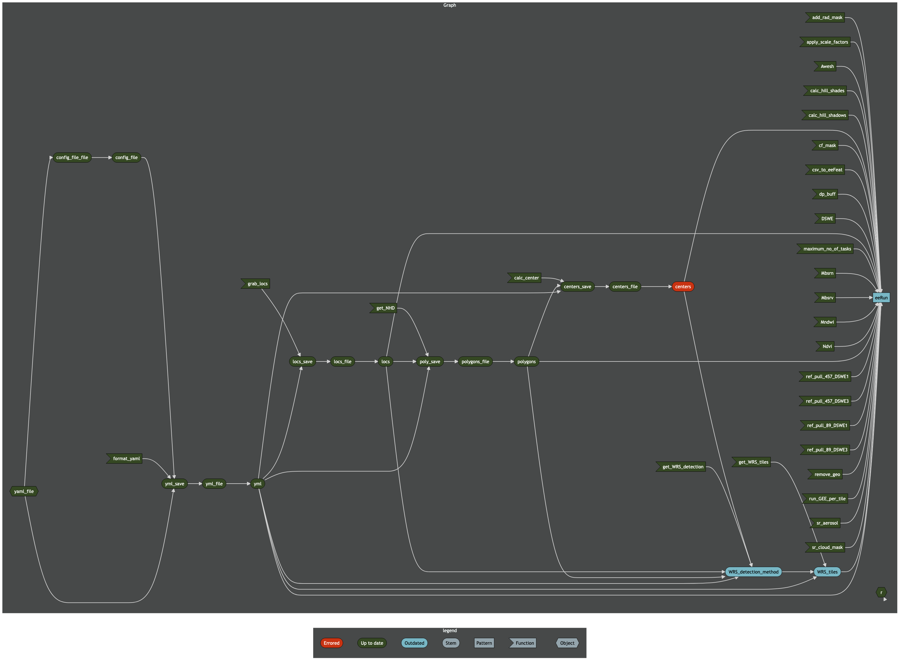

# Purpose

This script loads all necessary packages to run the targets pipeline, then runs it!

## Install necessary packages

Define package installer function

```{r package_installer}
package_installer <- function(x) {
  if (x %in% installed.packages()) {
    print(paste0('{', x ,'} package is already installed.'))
    } else {
      install.packages(x)
      print(paste0('{', x ,'} package has been installed.'))
    }
  }
```

List packages that need to be checked for install, and walk the function along them all.

```{r walk_package_installer}
packages <- c('tidyverse',
              'reticulate',
              'targets',
              'tarchetypes',
              'yaml',
              'readr',
              'nhdplusTools',
              'polylabelr',
              'sf')
lapply(packages, package_installer)
```

## Authenticate and initialize Earth Engine

You will need to have [installed and initialized the `gcloud CLI`](https://cloud.google.com/sdk/docs/install) 
and have a [Google Earth Engine account](https://code.earthengine.google.com/register) prior to running this workflow. 
Some common troubleshooting solutions [can be found here]https://github.com/rossyndicate/ROSS_RS_mini_tools/blob/main/helps/CommonIssues.md).

### Authentication

To authenticate your GEE account, you must execute the following command in your **zsh** terminal and follow the prompts in your browser:

`earthengine authenticate`

When complete, your terminal will read:

`Successfully saved authorization token.`

This token is valid for 7 days from the time of authentication.

### Initializing your instance of GEE

Initialization through the Python command `ee.Initialize()` is automatically completed in the workflow.

## Run the targets pipeline and output a network graph.

Prior to running this pipeline, you'll need to populate the `config.yml` file with the 
information for the Landsat Surface Reflectance and Surface Temperature Collection 2 
product stack pull. Additionally, you will need to change line 5 of the `_targets.R` file 
if you have renamed the config file from `config.yml`.

```{r run_targets}
library(targets)

# run the pipeline
tar_make()
```

Only errors that prematurely 
end the pipeline need to be addressed. Check the network diagram in the next section 
to confirm you've successfully run the pipeline. As long as your dialog box reads 'end pipeline' 
after 'built pattern eeRun', this workflow has successfully completed.

### Create a network diagram of the workflow.

```{r write_mermaid}
# save the mmd file
writeLines(tar_mermaid(), sep = '\n', 'mermaid.mmd')
```

```{zsh create_mermaid_png}
mmdc -i mermaid.mmd -o mermaid.png -t dark -w 4000 -H 1000
```



In order to view [legible] text, right click the image and open in a new window.

Depending on how your config file is set up, you may have a few red circles on this graph. The important part is that the square on the right hand side is either orange or green.
