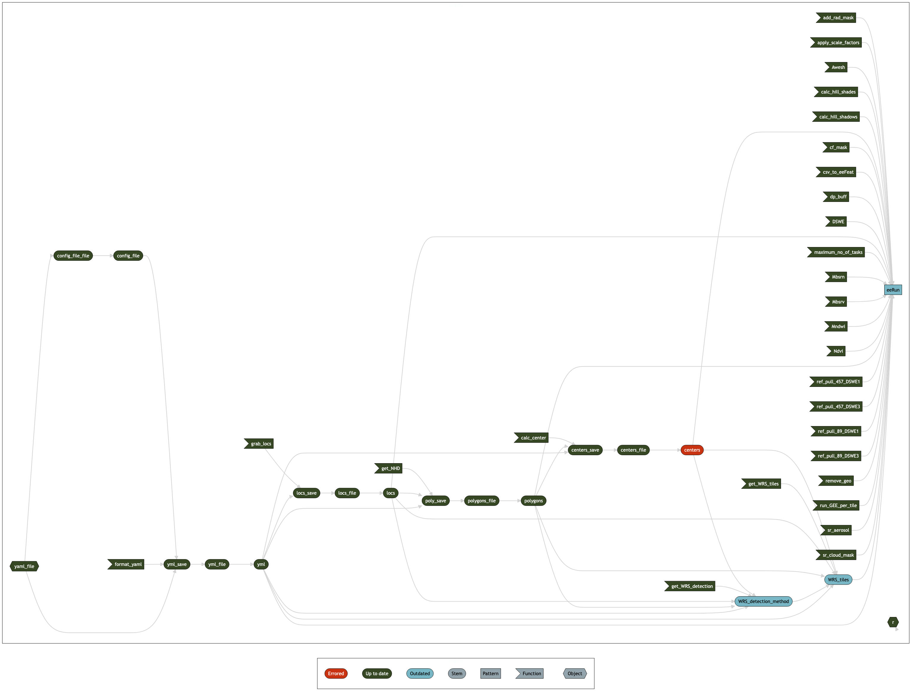

# Purpose

This script loads all necessary packages to run the targets pipeline, then runs it! This particular instance pulls the historical Landsat record for Northern Water and all reservoirs greater than 0.01km\^2 in the Cache La Poudre HUC 8 watershed. The locations file referenced in the yaml config file was generated in targets branch "a" of the [NW-CLP-RS repository](https://github.com/rossyndicate/NW-CLP-RS).

Running this pipeline requires access to both the successfully run a branch of the NW-CLP-RS repository and access to the ROSSyndicate Google Account. If attempting to reproduce this pipeline, you may need to alter the filepath for the NW-CLP-RS in the yml file. At a future point, when this workflow is stable, this pipeline will be integrated into the NW-CLP-RS pipeline to reduce the interdependence between the two repositories.

This pipeline has been further modified from the original version (modeled after Topp et al) to:

1)  remove the SR mask from the LS4-7 pull

2)  fill mask (0 are masked) and realistic values filtered (Rrs \>-0.01)

3)  mask SR_ATMOS_OPACITY \>0.3 and SR_QA_AEROSOL high flags

## Install necessary packages

```{r package_installer, echo = F}
package_installer <- function(x) {
  if (x %in% installed.packages()) {
    print(paste0('{', x ,'} package is already installed.'))
    } else {
      install.packages(x)
      print(paste0('{', x ,'} package has been installed.'))
    }
  }
```

List packages that need to be checked for install, and walk the function along them all.

```{r walk_package_installer, message = F}
packages <- c('tidyverse',
              'reticulate',
              'targets',
              'tarchetypes',
              'yaml',
              'nhdplusTools',
              'polylabelr',
              'sf')

lapply(packages, package_installer)
```

## Authenticate and initialize Earth Engine

You will need to have [installed and initialized the `gcloud CLI`](https://cloud.google.com/sdk/docs/install) and have a [Google Earth Engine account](https://code.earthengine.google.com/register) prior to running this workflow. Some common troubleshooting solutions [can be found here]<https://github.com/rossyndicate/ROSS_RS_mini_tools/blob/main/helps/CommonIssues.md>).

### Authentication

To authenticate your GEE account, we will use a Python environment created in the R file 'data_acquisition/src/py/pySetup.R'

```{r}
source('data_acquisition/py/pySetup.R')
```

```{python}
import ee
ee.Authenticate()
```

### Initializing your instance of GEE

Initialization through the Python command `ee.Initialize()` is automatically completed in the workflow.

## Run the targets pipeline and output a network graph.

Prior to running this pipeline, you'll need to populate the `config.yml` file with the information for the Landsat Surface Reflectance and Surface Temperature Collection 2 product stack pull. Additionally, you will need to change line 5 of the `_targets.R` file if you have renamed the config file from `config.yml`.

```{r run_targets, echo = F}
library(targets)

# run the pipeline
tar_make()
```

Only errors that prematurely end the pipeline need to be addressed. Check the network diagram in the next section to confirm you've successfully run the pipeline. As long as your dialog box reads 'end pipeline' after 'built pattern eeRun', this workflow has successfully completed.

### Create a network diagram of the workflow.

```{r create_target_vis, echo=F, message=FALSE}
# save the mmd file
writeLines(tar_mermaid(), sep = '\n', 'mermaid/mermaid.mmd')
```

```{r write_mermaid, echo = F, message = F}
# save the mmd file
writeLines(tar_mermaid(), sep = '\n', 'mermaid/mermaid.mmd')
```

```{zsh create_mermaid_png}
mmdc -i mermaid/mermaid.mmd -o mermaid/mermaid.png -t dark -w 4000 -H 1000
```



In order to view [legible] text, right click the image and open in a new window. The `centers` icon will be marked red as errored - this is because the config file is not set to calculate centers for this pipeline.
